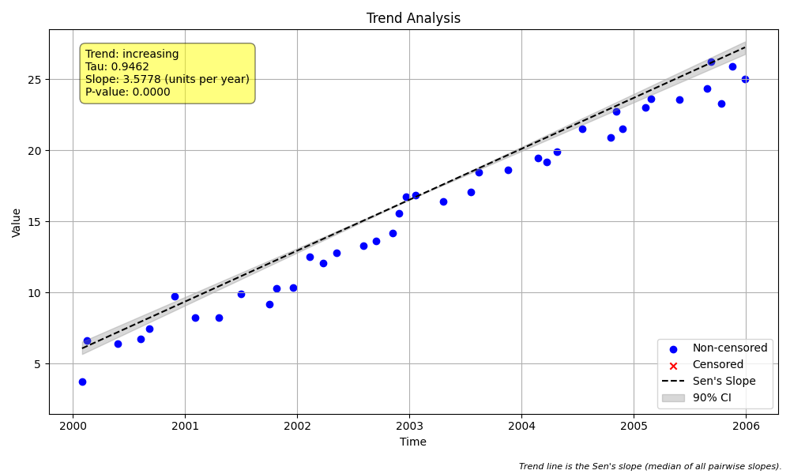

# Validation Case V-19: Unequally Spaced Time Series

## Objective
This validation case demonstrates and explains a key methodological difference between `MannKS` and the LWP-TRENDS R script: the handling of unequally spaced time series data. The goal is to show *why* the results for p-value and confidence intervals diverge.

## Data
A synthetic dataset of 40 samples was generated with a clear positive trend. The time gaps between samples were randomized to be between 10 and 100 days, simulating an irregular, non-annual sampling schedule.

## Methodological Difference

The core difference lies in how the Mann-Kendall test's variance (`var(S)`) is calculated, which directly impacts the Z-score, p-value, and confidence intervals.

-   **`MannKS`**: This package is designed for unequally spaced data. It uses the ranks of the numeric timestamps directly in its calculations. This is the statistically standard and correct approach for this type of data.

-   **LWP-TRENDS R Script**: The R script's `GetKendal` function is not designed for continuous time. It converts the timestamps into simple integer ranks (`1, 2, 3, ...`). This effectively treats the unequally spaced data as if it were equally spaced, which can lead to an inaccurate estimation of the test's variance and, consequently, its significance. The Sen's slope itself, however, is calculated using the true time differences and should be similar.

## Results Comparison

The results below highlight the expected divergence. The Sen's slopes are similar, but the p-values and confidence intervals differ due to the different variance calculations. The R script was run in its default aggregated mode (`TimeIncrMed=TRUE`) to bypass a known bug in its unaggregated workflow.

| Metric              | MannKS (Standard) | MannKS (LWP Mode) | LWP-TRENDS R Script |
|---------------------|-----------------------|-----------------------|---------------------|
| p-value             | 0.000000   | 0.000000        | 0.008535     |
| Sen's Slope         | 3.577791 | 3.577791    | 3.500002       |
| Lower CI (90%)      | 3.417578 | 3.417926 | 3.150785    |
| Upper CI (90%)      | 3.715487 | 3.714328 | 3.799156    |

## Conclusion
This validation case successfully demonstrates a key improvement of the `MannKS` package over the LWP-TRENDS R script.

- The **Sen's slopes are broadly similar** across all methods because the slope calculation correctly uses the true time differences.
- The **p-values and confidence intervals diverge** because `MannKS` correctly uses the rank of the continuous timestamps for its variance calculation, while the R script incorrectly uses integer ranks, treating the data as equally spaced.

This confirms that `MannKS` provides a more statistically robust and accurate significance test for real-world, unequally spaced data.
